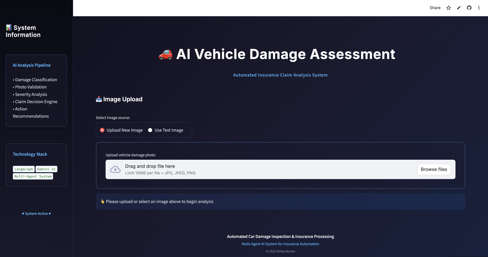
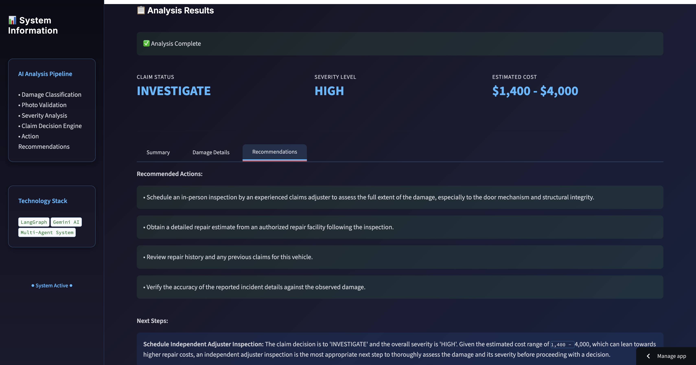
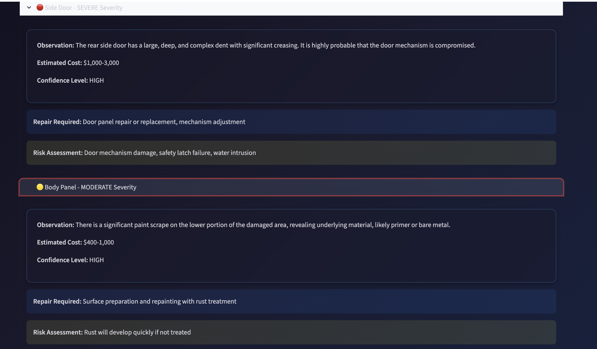

# AI Vehicle Damage Assessment System

An intelligent multi-agent system for automated vehicle damage detection and insurance claim processing using computer vision and large language models.

[](https://car-damage-ai.streamlit.app)
[](https://www.python.org/downloads/)
[](https://creativecommons.org/licenses/by-nc-nd/4.0/)

## Live Demo

**Try it now:** [https://car-damage-ai.streamlit.app](https://car-damage-ai.streamlit.app)

Upload a photo of vehicle damage and get instant AI-powered assessment with cost estimation and claim recommendations.

## IT LOOKS LIKE : 

### Home Interface


### Upload & Analysis


### Results Dashboard


### Detailed Damage Report

<<<<<<< HEAD
##  Features
=======
## Features
>>>>>>> add99f6b47ae671877f6169b1b2930a01f00e79f

- **5-Agent AI Pipeline**
  - Damage Classification Agent
  - Photo Validation Agent  
  - Severity Analysis Agent
  - Claim Decision Engine
  - Action Recommendation System

<<<<<<< HEAD
- **Modern Dark UI** - Professional, responsive interface
- **Detailed Analysis** - Component-level damage assessment
- **Cost Estimation** - Automated repair cost calculation
- **Fraud Detection** - Pattern recognition for suspicious claims
- **Real-time Processing** - 30-40 second analysis time
=======
- ** Modern Dark UI** - Professional, responsive interface
- ** Detailed Analysis** - Component-level damage assessment
- ** Cost Estimation** - Automated repair cost calculation
- ** Fraud Detection** - Pattern recognition for suspicious claims
- ** Real-time Processing** - 30-40 second analysis time
>>>>>>> add99f6b47ae671877f6169b1b2930a01f00e79f

## Architecture

### 5-Agent Pipeline

```

┌──────────────────────────────────────────────────────┐
│                    USER UPLOADS IMAGE                 │
└────────────────────┬─────────────────────────────────┘
↓
┌────────────────────┐
│  AGENT 1: CLASSIFIER│
│  Identifies damage  │
│  type \& category    │
└─────────┬───────────┘
↓
┌────────────────────┐
│  AGENT 2: VALIDATOR│
│  Checks photo       │
│  quality \& auth     │
└─────────┬───────────┘
↓
┌────────────────────┐
│  AGENT 3: ANALYZER │
│  Assesses severity │
│  \& estimates cost  │
└─────────┬───────────┘
↓
┌────────────────────┐
│  AGENT 4: DECISION │
│  Approves/rejects  │
│  claim             │
└─────────┬───────────┘
↓
┌────────────────────┐
│ AGENT 5: RECOMMENDER│
│  Suggests next     │
│  actions           │
└────────────────────┘

```


### **Tech Stack**

- **Frontend:** Streamlit (Python)
- **AI Framework:** LangGraph (Multi-agent orchestration)
- **LLM:** Google Gemini 1.5 (Flash & Pro models)
- **Vision:** Gemini Vision API
- **Deployment:** Streamlit Cloud
- **Version Control:** Git/GitHub

<<<<<<< HEAD
##  Quick Start
=======
## Quick Start
>>>>>>> add99f6b47ae671877f6169b1b2930a01f00e79f

### **Prerequisites**

- Python 3.12+
- Google Gemini API key ([Get one here](https://aistudio.google.com/))

### **Installation**

## Clone the repository

```bash
git clone https://github.com/nitikaborkar/insurance-claim-damage-ai.git
cd insurance-claim-damage-ai
```

## Create virtual environment
```bash
python -m venv venv
source venv/bin/activate # On Windows: venv\Scripts\activate
```

## Install dependencies
```bash
pip install -r requirements.txt
```

## Create .env file
```bash
echo "GOOGLE_API_KEY=your_api_key_here" > .env
```

### **Run Locally**
```bash 
streamlit run streamlit_app.py
```

<<<<<<< HEAD
```
## 📁 Project Structure
=======
## Project Structure
>>>>>>> add99f6b47ae671877f6169b1b2930a01f00e79f

```

insurance-claim-damage-ai/
│
├── streamlit_app.py              \# Main application entry point
│
├── car_agent/                    \# Core agent logic
│   ├── __init__.py
│   ├── service.py                \# Business logic layer
│   ├── graph.py                  \# LangGraph workflow
│   ├── nodes.py                  \# Agent implementations
│   ├── state.py                  \# State management
│   └── config.py                 \# Configuration settings
│
├── data/                         \# Knowledge base
│   ├── vehicle_damage_types.json \# Damage taxonomy
│   └── claim_actions.json        \# Action catalog
│
├── testing_images/               \# Sample test images
│   ├── collision_front.jpg
│   ├── side_impact.png
│   └── windshield_crack.jpg
│
├── screenshots/                  \# App screenshots
│
├── requirements.txt              \# Python dependencies
├── .gitignore                   \# Git ignore rules
├── LICENSE                      \# CC BY-NC-ND 4.0
└── README.md                    \# Documentation

```


## How It Works

1. **Image Upload:** User uploads vehicle damage photo
2. **Agent 1 - Classifier:** Categorizes damage type (front-end collision, side impact, etc.)
3. **Agent 2 - Validator:** Verifies photo quality and authenticity
4. **Agent 3 - Analyzer:** Performs detailed damage assessment with confidence scores
5. **Agent 4 - Decision Maker:** Determines claim status (Approve/Investigate/Reject)
6. **Agent 5 - Recommender:** Suggests next actions and repair protocols

<<<<<<< HEAD
##  Supported Damage Categories
=======
## Supported Damage Categories
>>>>>>> add99f6b47ae671877f6169b1b2930a01f00e79f

- Front-End Collision
- Rear-End Collision  
- Side Impact
- Windshield Damage
- Roof Damage
- Undercarriage Damage
- Hail/Weather Damage
- Vandalism
- Fire Damage
- Others (General analysis)

<<<<<<< HEAD
##  Use Cases
=======
## Use Cases
>>>>>>> add99f6b47ae671877f6169b1b2930a01f00e79f

- **Insurance Companies:** Automated first-pass claim assessment
- **Auto Repair Shops:** Instant damage evaluation
- **Fleet Management:** Bulk vehicle inspection
- **Car Dealerships:** Pre-sale condition reports
- **Individual Owners:** DIY damage assessment before filing claims

<<<<<<< HEAD
##  Security & Privacy
=======
## Security & Privacy
>>>>>>> add99f6b47ae671877f6169b1b2930a01f00e79f

- No data storage - All processing is ephemeral
- API keys stored securely in environment variables
- No personal information collected
- HTTPS encrypted communication

<<<<<<< HEAD
##  Performance
=======
## Performance
>>>>>>> add99f6b47ae671877f6169b1b2930a01f00e79f

- **Analysis Time:** 30-40 seconds per image
- **Accuracy:** ~85-90% damage classification
- **Cost:** ~$0.001-0.002 per analysis (Gemini API)
- **Uptime:** 99.9% (Streamlit Cloud)


## License

Copyright © 2025 Nitika Borkar. All Rights Reserved.

This project is licensed under the [Creative Commons Attribution-NonCommercial-NoDerivatives 4.0 International License](https://creativecommons.org/licenses/by-nc-nd/4.0/).

**This means:**
- ✅ You may view and share this project with attribution
- ❌ You may NOT use this commercially
- ❌ You may NOT modify or create derivative works
- ❌ You may NOT claim this work as your own

For commercial use or licensing inquiries, please contact me.

## ⚖️ Important Notice

This project was developed as part of my academic work at Nanyang Technological University and is protected for portfolio and demonstration purposes. Unauthorized reproduction, particularly for job applications or academic submissions, is strictly prohibited.
